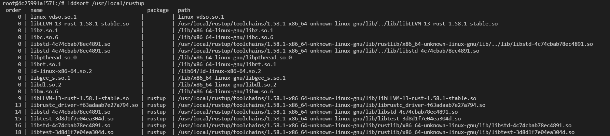
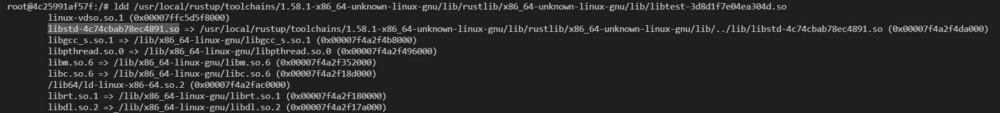

# lddsort

## About This Tool

This is a CLI to sort the shared library (lib***.so) according to the dependencies provided by the ldd command.  
We developers sometimes have a hard time resolving the build order of shared libraries even though we have the build shells.  
This tool helps us to do that with pre-built shared libraries.

*This tool only works on linux.

## Usage

    lddsort [OPTIONS] <target_pkg_path>...

    ARGS:
        <target_pkg_path>...    Path to shared libraries

    OPTIONS:
        -d               Display detail log
        -h, --help       Print help information
        -V, --version    Print version information

## Outout

## About Output

- "order" indicate the build order of each shared libraries. 
    - For the above example, "libtest-3d8d1f7e04ea304d.so" (18) depends on "libstd-4c74cbab78ec4891.so" (16). So you have to build (16) first to build (18).
    - "0" means the shared library is not included in the package you specified.
    - 
- "package" indicates which of the specified directories contains the shread library. This could be multiple if you gave multiple package directory to the argument.

## How to build

First of all you have to install docker on your computer.  
Then
- For windows user, excute build.bat  
- For mac/linux user, excute build.sh  